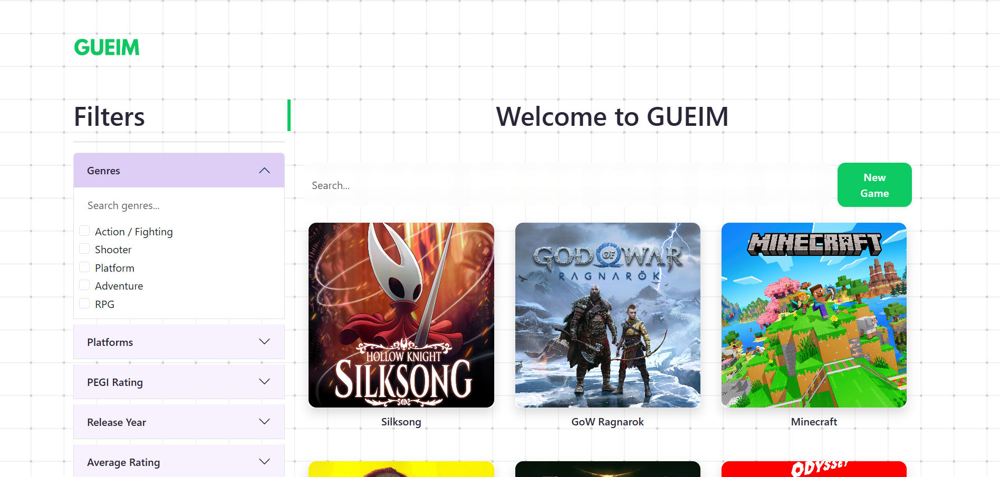
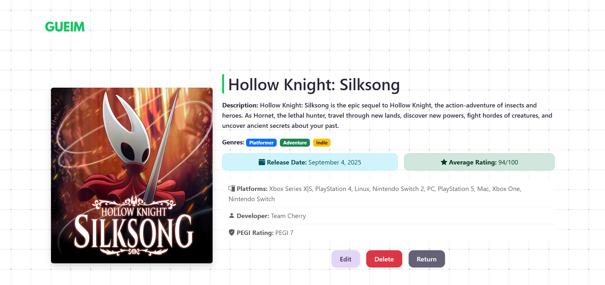
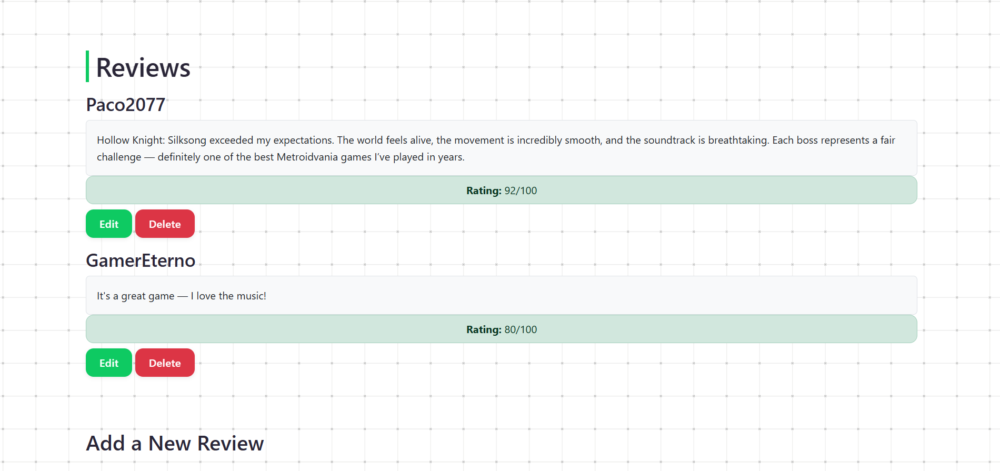
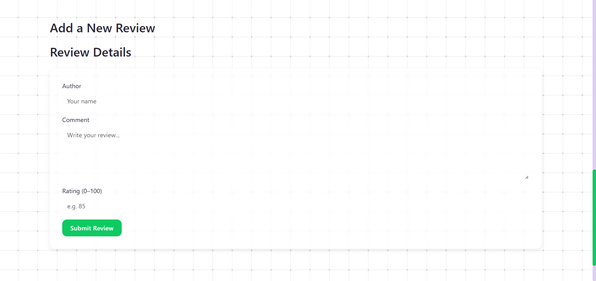
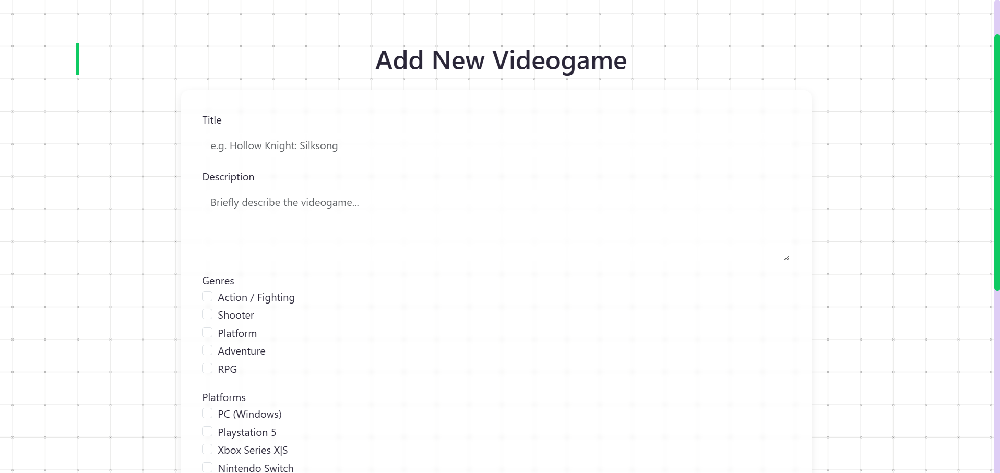
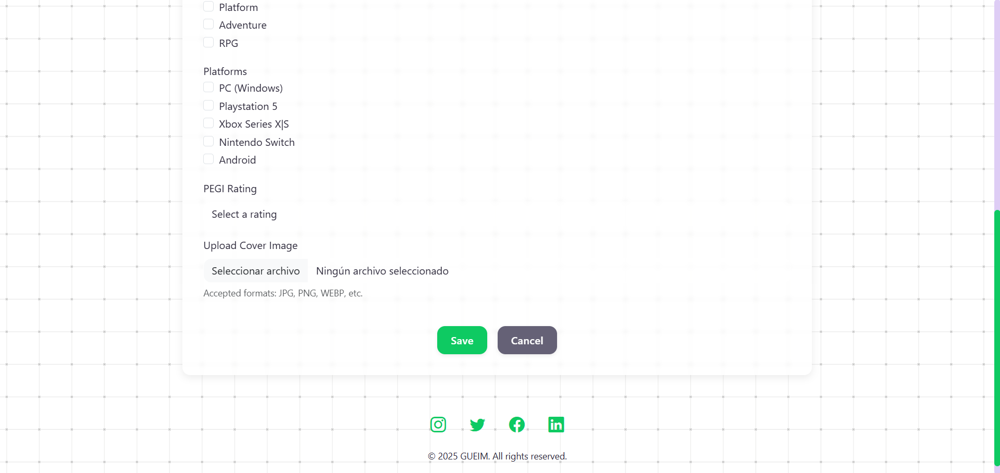

# Videogames Store
# Web Name: GUEIM 

## Team Members

-   **Daniel Bonachela Martínez** – [d.bonachela.2022@alumnos.urjc.es](mailto:d.bonachela.2022@alumnos.urjc.es) – [GitHub Profile](https://github.com/fuihfuefuiewn)
-   **Marcelo Atanasio Domínguez Mateo** – [ma.dominguez.2022@alumnos.urjc.es](mailto:ma.dominguez.2022@alumnos.urjc.es) – [GitHub Profile](https://github.com/sa4dus)
-   **Alejandro Garcia Prada** – [a.garciap.2022@alumnos.urjc.es](mailto:a.garciap.2022@alumnos.urjc.es) – [GitHub Profile](https://github.com/AlexGarciaPrada)

## Functionality

### Entities

#### Main Entity

-   **Entity Name**: Videogame
-   **Description**: Represents each game listed in the platform
-   **Attributes**:
    -   `title`
    -   `description`
    -   `genre`
    -   `platform`
    -   `release_year`
    -   `developer`
    -   `cover_image`
    -   `pegi_rating`
    -   `average_rating`: from 0 to 100

#### Secondary Entity

-   **Entity Name**: Review
-   **Description**: Represents user's rating and written opinion about a videogame.
-   **Attributes**:
    -   `author`      
    -   `rating`
    -   `comment`
    -   `created_at`

### Images

-   **Main Entity**: Videogames will have an associated `cover_image`.

### Search and Filtering
-   **Search**: Users can search Videogames by name.
-   **Filtering**: The application allows filtering Videogames based on `genre`, `platform`, `release_year`, `developer`, `pegi_rating` and `average_rating` (within an interval).

# Práctica 1
## Captures of the website

*main page capture*

*detail page capture 1*

*detail page capture 2*

*detail page capture 3*

*form page capture 1*

*form page capture 2*
---
## Member participation

### Marcelo Atanasio Domínguez Mateo

I implemented the display of the main entity data, the filter sidebar, and the footer, along with some style adjustments.

**Main commits:**

-   [Set details page layout](https://github.com/CodeURJC-FW-2025-26/webapp01/commit/16104a6)
-   [First version of sidebar](https://github.com/CodeURJC-FW-2025-26/webapp01/commit/7cd538d)
-   [Prior version of footer](https://github.com/CodeURJC-FW-2025-26/webapp01/commit/bea8db7)
-   [Add footer to detail and form pages](https://github.com/CodeURJC-FW-2025-26/webapp01/commit/2453d01)
-   [Add page layouts using bootstrap grid system](https://github.com/CodeURJC-FW-2025-26/webapp01/commit/94cd7e6)

**Modified files:**

-   `src/pages/detail.html`
-   `src/css/style.css`
-   `src/pages/form.html`
-   `src/pages/index.html`
### Alejandro García Prada

I implemented the forms for adding video games (main entity) and reviews (secundary entity), along with the header and reviews display.

**Main commits:**

-   [Form for new reviews added](https://github.com/CodeURJC-FW-2025-26/webapp01/commit/36cdd0f)
-   [Creation of form.html](https://github.com/CodeURJC-FW-2025-26/webapp01/commit/e8703da)
-   [Reviews added to detail page](https://github.com/CodeURJC-FW-2025-26/webapp01/commit/7781357)
-   [Nav bar addded to the pages](https://github.com/CodeURJC-FW-2025-26/webapp01/commit/e821bf2)
-   [navs added](https://github.com/CodeURJC-FW-2025-26/webapp01/commit/8bf5a5c)

**Modified files:**

-   `src/pages/form.html`
-   `src/pages/index.html`
-   `src/pages/detail.html`
  
### Daniel Bonachela Martínez

I created the main page section, found and added the images, and fixed minor issues in form.html and detail.html.

**Main commits:**
- [grid restored](https://github.com/CodeURJC-FW-2025-26/webapp01/commit/bbf10a5)
- [Restored](https://github.com/CodeURJC-FW-2025-26/webapp01/commit/3261865)
- [Routes](https://github.com/CodeURJC-FW-2025-26/webapp01/commit/d60dfee)
- [Add page layouts using bootstrap grid system](https://github.com/CodeURJC-FW-2025-26/webapp01/commit/94cd7e6)
- [Details](https://github.com/CodeURJC-FW-2025-26/webapp01/commit/91f50ea)

**Modified files:**

-   `src/pages/form.html`
-   `src/pages/index.html`
-   `src/pages/detail.html`

# Práctica 2
## Getting Started
Clone the repo:
```bash
git clone https://github.com/CodeURJC-FW-2025-26/webapp01
``` 

Start MongoDB:
```bash
sudo systemctl start mongod
sudo systemctl enable mongod
sudo systemctl status mongod # should show active (running)
```

This webapp was developed with `npm v11.6.2`, `node v24.11.1` and `mongod v8.2.1`.

Here's the detailed config.
```bash
$ npm --version
11.6.2
$ node --version
v24.11.1
$ mongod --version
db version v8.2.1
Build Info: {
    "version": "8.2.1",
    "gitVersion": "3312bdcf28aa65f5930005e21c2cb130f648b8c3",
    "openSSLVersion": "OpenSSL 3.0.13 30 Jan 2024",
    "modules": [],
    "allocator": "tcmalloc-google",
    "environment": {
        "distmod": "ubuntu2404",
        "distarch": "x86_64",
        "target_arch": "x86_64"
    }
}
```

Install dependencies and start the server:
```bash
npm install
npm start
```

Access the app at: `http://localhost:3000`

## Files description
### app.js
Configures and starts the web server, connects to the DB, and loads initial data.
### load_data.js
Reads the example data, such as games, reviews... Also resets the uploads folder and copies the initial images. 
### router.js
Defines and handles all web routes.
### service.js
Wrappers that handle the interactions with Monkito, so that no other part of the app can access the database (directly).
### monkito.js
Consists of generic classes for structured and safe MongoDB access with models, queries, and CRUD operations.
### monkito.test.js
Tests that ensure that monkito works correctly.
### confirm.js
Confirmation message.
### detail.js
The detail page manages the display of game's information and the reviews, allowing to interact with all of it.
### error.js
Error message.
### form.js
Checks that the form contains all required fields and handles creating and editing games.
### games.js
Returns the filtered games and sets up pagination and filter states for index.html.
### styles.css
The different styles the web uses
### confirm.html
A page that allows to return to /detail or / (depending of the id)
### detail.html
The page that display the detail page issues, from the game's description to the reviews it has
### edit-game-form.html
Has a button to edit videogames in detail page
### edit-review.html
The html that is shown when the user wants to edit a review
### error.html
A page that shows what kind of error has occured
### footer.html
A html with the footer links, it is used by the rest of .html
### form.html
The page that allows to introduce a new game to the web
### header.html
A html with the header, that has the logotype, it is used by the rest of .html
### index.html
The main page html, it shows the search bars, filters, the games and the pagination 
### new-game-form.html
The html that links with the one that has the form to add new games
## Video

https://youtu.be/J8Z8GILYRMQ

## Member Participation

### Daniel Bonachela Martínez

I made the pagination, the reviews backend (except delete), the connections to use Monkito.js in service.js and the confirmation/error handlers and html's. 

**Main commits:**
- Waiting for merges

**Modified files:**
- `src\app.js`
- `src\router.js`
- `src\handlers\games.js`
- `src\handlers\error.js`
- `src\handlers\detail.js`
- `src\handlers\confirm.js`
- `views\confirm.html`
- `views\detail.html`
- `views\edit-review.html`
- `views\error.html`
- `views\index.html`

### Alejandro García Prada

I have worked on the main entity form (for editing and creating games) and on deleting reviews and games. I have also been responsible for moving part of the HTML from Practice 1 to Mustache partials and fixing styles.

**Main commits:**

- [Game Edition](https://github.com/CodeURJC-FW-2025-26/webapp01/commit/930d84a32bdbf382f5242e50c6e99ebc087fbf0f)
- [Generic Form](https://github.com/CodeURJC-FW-2025-26/webapp01/commit/ff17775019f4381d80296502400792d29f84b913)
- [Adding forms to db](https://github.com/CodeURJC-FW-2025-26/webapp01/commit/6212fbb15751c5917669ac005203d419af4a37ba)
- [First Version](https://github.com/CodeURJC-FW-2025-26/webapp01/commit/4c2cd9c04c2eecfab216c49c58608a1bffa25708)
- [added confirm for delete](https://github.com/CodeURJC-FW-2025-26/webapp01/commit/af38e2f9f1f44b531dcf69d01f9cafd9663484bb)

**Modified files:**

- `src\public\css\style.css`
- `src\router.js`
- `src\service.js`
- `src\handlers\form.js`
- `src\handlers\error.js`
- `src\handlers\detail.js`
- `src\handlers\confirm.js`
- `views\confirm.html`
- `views\detail.html`
- `views\edit-review.html`
- `views\error.html`
- `views\form.html`
- `views\new-game-form.html`
- `views\edit-game-form.html`
- `views\header.html`
- `views\footer.html`
